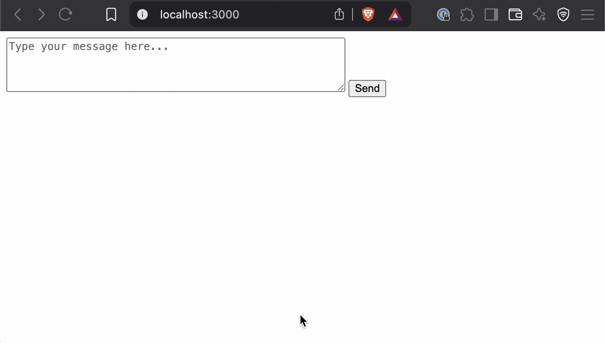

# Simple Claude Chat Demo

A minimalist chat interface for Anthropic's Claude AI using streaming responses. Built with vanilla JavaScript and Node.js



## Setup

1. Clone this repository
```
git clone https://github.com/kahwee/streaming-demo.git
cd streaming-demo
```

2. Add your Anthropic API key in `server.js`
```javascript
// Set your API key here
const API_KEY = "YOUR_API_KEY_HERE";
```

3. Start the server
```
node server.js
```

4. Open your browser to [http://localhost:3000](http://localhost:3000)

## How it Works

- `index.html` provides a simple chat interface
- `server.js` acts as a proxy to the Anthropic API
- Streaming responses are handled in real-time
- Conversation history is maintained in the browser

## Example Response Format

The server streams data from the Anthropic API in this format:

```
event: content_block_delta
data: {"type":"content_block_delta","index":0,"delta":{"type":"text_delta","text":"Hello"}}

event: content_block_delta
data: {"type":"content_block_delta","index":0,"delta":{"type":"text_delta","text":", how"}}

event: content_block_delta
data: {"type":"content_block_delta","index":0,"delta":{"type":"text_delta","text":" can I help"}}

event: content_block_delta
data: {"type":"content_block_delta","index":0,"delta":{"type":"text_delta","text":" you today?"}}
```

## License

MIT
